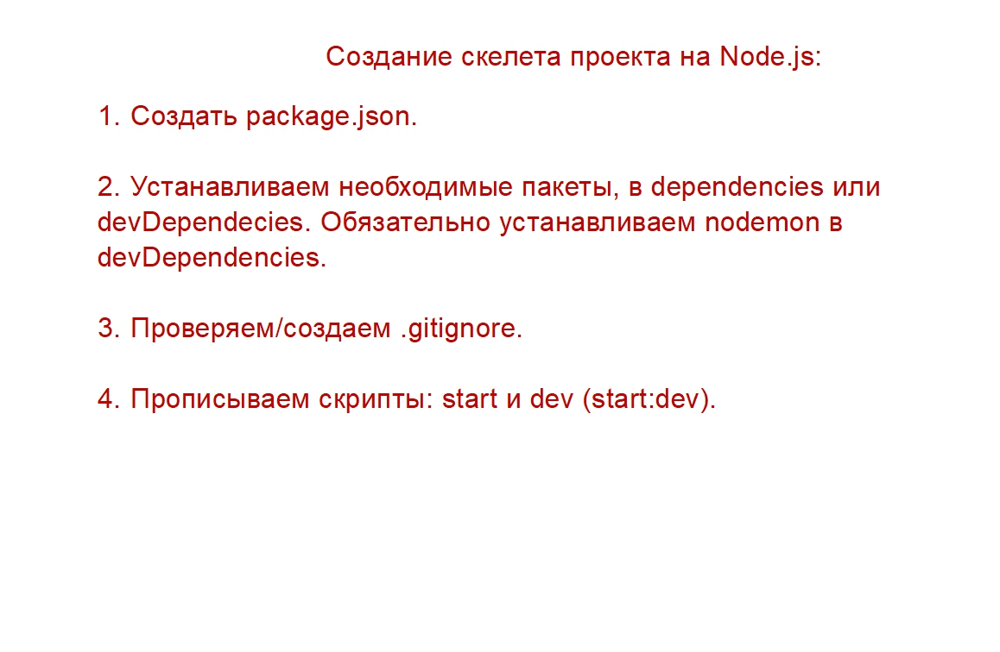

# node.js-mod01

project-example
 
 $ npm init -y 

 $ npm install cors express 

 //$ npm install validator

 Create a new project on Node.js
 

 1)
 $ npm init -y 

2)
 $ npm install cors express 
 $ npm install validator

 $ npm  install ts-node --save-dev
 $ npm  i ts-node -D
 $ npm i jest -D

 $ npm  i -g  yarn // install global
 $ yarn add mongoose
 $ yarn // = npm i  // yarn add  // yarn remove

3)
 change .gitignore	 

4)
  scripts: start & dev (start:dev) 
   + "start:dev":
   $ npm i nodemon -D
  
   $ npm run start:dev